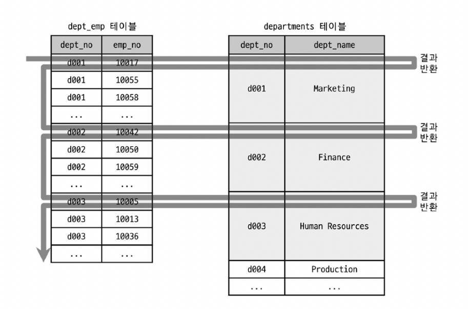
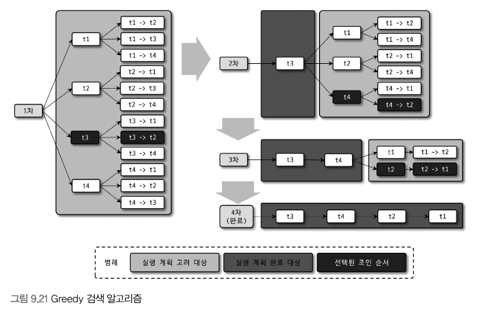

**3-1-5) 인덱스 머지**
- 인덱스를 이용해 쿼리를 실행하는 경우, 대부분 옵티마이저는 테이블별로 하나의 인덱스만 사용하도록 쿼리를 수립하지만, 인덱스 머지 실행 계획을 사용하면 *하나의 테이블에 대해 2개 이상의 인덱스를 이용해 쿼리를 처리*
- 쿼리에서 한 테이블에 대한 WHERE 조건이 여러 개 있더라도, 하나의 인덱스에 포함된 칼럼의 조건만으로 인덱스를 검색하고 나머지 조건은 읽어온 레코드에 대해서 체크하는 형태로만 사용되는 것이 일반적임.
- 하지만 쿼리에 사용된 각각의 조건이 서로 다른 인덱스를 사용할 수 있고, 그 조건을 만족하는 레코드 건수가 많을 것으로 예상되면 **인덱스 머지 계획을 선택**
- 머지 실행계획은 아래와 같이 3개의 세부 실행 계획으로 나누어 볼 수 있다.
	- index_merge_intersection
	- index_merge_sort_union
	- index_merge_union

**3-1-6) 인덱스 머지 - 교집합**

```sql
select *
from employees
where first_name = 'junhee' and emp_no between 10000 and 20000;
```
- 조건절에 걸리는 두 개의 칼럼이(first_name, emp_no) 각각 인덱스를 가지고 있다고 가정할 때, 둘 중 어떤 조건을 사용하더라도 인덱스를 사용할 수 있다.
	  -> 고로 옵티마이저는 ix_firstname과 PRIMARY 키를 모두 사용해서 쿼리를 처리하기로 결정한다.
- 실행 계획에서, Extra 칼럼의 *Using intersect* 를 통해, 인덱스 여러개 사용 후 교집합을 반환했음을 확인 가능

- first_name 칼럼과 emp_no 칼럼의 조건 중 하나라도 충분히 효율적으로  처리할 수 있었다면.. 옵티마이저는 2개의 인덱스를 모두 사용하는 실행 계획을 사용하지 않았을 것

**3-1-7) 인덱스 머지 - 합집합** 
- Using Union은 WHERE 절에 사용된 2개 이상의 조건이 각각의 인덱스를 사용하되, OR 연산을 통해 연결된 경우 사용되는 최적화
```sql
select *
from employees
where first_name = 'junhee' or birth_date = '1998-04-03';
```

- 위 쿼리 조건절 두 개의 칼럼(first_name, birth_date)이 각각의 인덱스를 가지고 있다고 가정했을 때, 두 조건 모두 인덱스를 사용할 수 있다
- 실행 계획에서 Extra 칼럼의 *Using union* 을 통해, 각각의 인덱스 검색 결과를 Union 알고리즘으로 병합했음을 확인 가능
	- 이 과정에서 인덱스 머지 사용시, 중복을 제거해주어야 함
	- 각각의 인덱스로 조회 시 pk를 기준으로 정렬되어 있으므로, 인덱스 머지 수행시 각 집합에서 하나씩 가져와 비교하며 중복된 레코드를 제거 가능(우선순위 큐 사용 가능)

- 두 조건이 AND 연산으로 연결된 경우, 둘 중 하나라도 인덱스를 탄다면 인덱스 레인지 스캔으로 쿼리가 실행 됨
- 두 조건이 OR 연산으로 연결된 경우, 둘 중 하나라도 인덱스를 못타면 풀 테이블 스캔으로만 처리 한다

**3-1-8) 인덱스 머지 - 정렬 후 합집합**
- 위의 Union 알고리즘은 정렬된 결과를 통해 중복제거를 하지만, 항상 정렬이 되어있지 않은 경우도 있음
- 만일 인덱스 머지 작업 도중 정렬이 필요하다면, Sort union 알고리즘을 사용
- 이 역시 실행계획에서 Extra 칼럼의 *Using sort_union*을 통해 확인 가능 

**3-1-9) 세미 조인**
- 타 테이블과 실제 조인을 수행하지 않고, 다른 테이블에서 조건에 일치하는 레코드가 없는지만 체크하는 형태의 쿼리
	- Table Pull-out
	- Duplicate Weed-out
	- First match
	- Loose Scan
	- Materializataion
	의 종류가 있다
```sql
select *
from employess e
where e.emp_no in (
	select de.emp_no
	from dept_emp de
	where de.from_date = '2002-06-03';
);
```

- 기존 MySQL 서버에 세미 조인 최적화 기능이 없었을 때, employee 테이블을 풀 스캔하면서 한 건 한 건 서브쿼리의 조건에 일치하는지 비교했음


- optimizer_switch 시스템 변수의 semijoin 옵티마이저 옵션을 firstmatch와 loosescan, materialization 옵티마이저 옵션을 한 번에 활성화하거나 비활성화할 때 사용

**3-1-10) 테이블 풀-아웃**
- 세미 조인의 서브쿼리에 사용된 테이블을 아우터 쿼리로 끄집어낸 후,
  쿼리를 조인 쿼리로 재작성하는 형태의 최적화 방식
  ->  in (subquery) 형태의 세미 조인이, 가장 빈번하게 사용되는 형태의 쿼리이다
```sql
-- 사용 쿼리
select *
from employees e
where e.emp_no in (
	select de.emp_no
	from dept_emp de
	where de.dept_no = 'doo9'
);

-- 최적화 후 실제로 날라가는 쿼리
select employees.e.emp_no as emp_no,
	   employees.e.birth_date as birth_date,
	   employees.e.last_name as first_name,
	   employees.e.gender as gender,
	   employees.e.hire_date as hire_date
from employees.dept_emp de
join employees.employees e
where ((employees.e.emp_no = employees.de.emp_no)
	  and (employees.de.dept_no = 'doo9'));
```

- 세미 조인 서브쿼리에서만 사용 가능하고, 서브쿼리 부분이 Unique 인덱스나 PK 룩업으로 결과가 1건인 경우에만 사용 가능하다
- Table pull out 최적화가 서브쿼리의 테이블을 아우터 쿼리로 가져와서 조인으로 풀어쓰는 최적화를 수행하는데, 만약 서브쿼리의 모든 테이블이 아우터 쿼리로 끄집어낼 수 있다면 서브쿼리 자체가 없어짐
- MySQL 튜닝 가이드에서 `최대한 서브쿼리를 조인으로 풀어서 사용하라` 는 가이드가 많은데, 사실 Table Pull Out이 이 가이드를 그대로 사용하는 것임. MySQL 8.0 이상 부터는 서브쿼리를 조인으로 안풀어도 됨!

- 실행계획 Extra 칼럼에 특별히 표기되는 것은 없다

**3-1-11) 퍼스트 매치**
- in (subquery) 형태의 세미 조인을 exists(subquery) 형태로 튜닝한 것과 비슷한 방법으로 실행됨
	- join으로 처리하며, 실제 테이블에 일치하는 레코드 1건만 찾으면 더이상의 테이블 검색을 하지 않음
	  -> 의미적으로 exists(subquery) 와 동일하게 수행
- 실행 계획 확인시 extra 칼럼에 firstmatch(table-n)가 나옴

- GROUP BY나 집합 함수가 사용된 서브쿼리의 최적화에는 사용될 수 없담

**3-1-12) 루스 스캔
- 루스 인덱스스캔과 비슷한 읽기 방식을 사용한다
```sql
select *
from departments d
where d.dept_no in (
	select de.dept_no
	from dept_emp de
);
```
- 위 쿼리는 루스 스캔 방식으로 최적화되는데, 다음과 같은 방식으로 처리된다


- 서브쿼리에 사용된 dept_emp 테이블이 드라이빙 테이블이 된다
- dept_emp 테이블의 pk를 dept_no 부분에서 유니크하게 한 건씩만 읽고 있음

- 실행계획 extra 칼럼에 LooseScan이라는 문구가 표시됨

 **3-1-13) 구체화**
 - 세미 조인에 사용된 서브쿼리를 통째로 구체화해서 쿼리를 최적화한다는 의미
 - 구체화는, **내부 임시 테이블을 생성한다**는 의미
 
```sql
-- 최적화 전
select *
from employees e
where e.emp_no in (
	select de.emp_no
	from dept_emp de
	where de.from_date = '2002-06-03'
);

-- 최적화 후
select *
from employees e
where e.emp_no in (
	select de.emp_no
	from dept_emp de
	where de.from_date = '2002-06-03'
	group by de.dept_no
);
```

- 위 쿼리는, FirstMatch 최적화를 사용하면 employees 테이블에 대한 조건이 드라이빙 테이블에는 아무것도 없어서 풀스캔 해야 함
  -> 고래서 등장한게 서브쿼리 구체화

**3-1-14) 중복 제거**
- 세미 조인 서브쿼리를 일반적인 inner join으로 바꿔서 실행 후, 마지막에 중복된 레코드를 제거하는 방법으로 처리
```sql
-- 최적화 전
select *
from employees e
where e.emp_no in (
	select s.emp_no
	from salaries s
	where s.salary > 15000
);

-- 최적화 후
select *
from employees e, salaries s
where e.emp_no = s.emp_no and salary > 15000
group by e.emp_no;
```

- 서브쿼리가 group by나 집합 함수가 사용된 경우는 사용 불가
- 중복 제거 최적화 방법은, 서브쿼리의 테이블을 조인으로 처리하기 때문에 최적화할 수 있는 방법이 많음

**3-1-15) 컨디션 팬아웃**
- 조인 실행시 테이블의 순서는 쿼리 성능에 매우 큰 영향을 미침
- MySQL 옵티마이저는 여러 테이블이 조인하는 경우, 가능하다면 일치하는 레코드 건수가 적은 순서대로 조인을 실행

- `condition_fanout_filter` 최적화 기능을 활성화하면, MySQL 옵티마이저는 더 정교한 계산을 거쳐 실행 계획을 수립함
- 하지만 그에 따라 더 많은 시간과 컴퓨터 자원을 사용하게 됨


**3-1-16) 파생 테이블 머지**
- 이전 버전의 MySQL 서버에서는 다음과 같이 FROM 절에 사용된 서브쿼리는 먼저 실행해서 그 결과를 임시 테이블로 만든 다음 외부 쿼리 부분을 처리하였음
- 5.7 버전부터는 파생 테이블로 만들어지는 서브쿼리를 외부 쿼리와 병합해서 서브쿼리부분을 제거하는 최적화가 도입됨
	-  `derived_merge` 옵션을 통해 설정할 수 있음

- 다음과 같은 경우에서는 옵티마이저가 서브쿼리를 외부쿼리로 병합 할 수 없음
	- `SUM()`, 혹은 `MIN()`, `MAX()` 같은 집계 함수가 사용된 서브쿼리
	- `DISTINCT` 가 사용된 서브쿼리
	- `GROUP BY`, `HAVING`이 사용된 서브쿼리
	- `LIMIT` 이 사용된 서브쿼리 
	- `UNION` 혹은 `UNION ALL` 을 포함하는 서브쿼리 
	- `SELECT` 절에 사용된 서브쿼리
	- 값이 변경되는 사용자 변수가 사용된 서브쿼리
	이 경우, 가능하다면 서브쿼리는 외부 쿼리로 수동으로 병합해서 작성하는 것이 쿼리 성능 향상에 도움이 됨
	
**3-1-17) 인비저블 인덱스**
- MySQL 8.0 부터 인덱스의 가용 상태를 제어할 수 있는 기능이 추가됨
```sql
ALTER TABLE ... ALTER INDEX ... [VISIBLE | INVIBIBLE];
```
이거 통해 설정 가능

**3-1-18) 스킵 스캔**
- 인덱스의 핵심은 값이 정렬돼 있다는 것, 고로 인덱스 구성하는 칼럼 순서가 매우 중요함. 
- 인덱스가 (A, B, C)로 구성되어있다고 가정, 쿼리에서 B와 C에 대한 조건만을 가지고 있다면 인덱스를 활용할 수 없다
	- 하지만, 스킵 스캔 최적화를 통해 B와 C를 통해 인덱스를 활용할 수 있음!
- 사용 조건
	- `where` 조건절에 조건이 없는 인덱스의 선행 칼럼의 유니크한 값의 개수가 적어야 함
	- 쿼리가 인덱스에 존재하는 칼럼만으로 처리가 가능해야 함
	

**3-1-19) 해시 조인**
- 네스티드 루프 조인이 사용되기에 적합하지 않은 경우를 위한 차선책
- 일반적인 경우 빌드 단계(Build-phase)와 프로브 단계(Probe-phase)로 나누어 처리됨
	- 빌드 단계에서는, 조인 대상 테이블 중에서 레코드 건수가 적어 해시 테이블로 만들기에 용이한 테이블을 골라 메모리에 해시 테이블을 생성(빌드)하는 작업을 수행
	- 프로브 단계에서는, 나머지 테이블의 레코드를 읽어 해시 테이블의 일치 레코드를 찾음

**3-1-20) 인덱스 정렬 선호**
- MySQL 옵티마이저는 `ORDER BY` 또는 `GROUP BY` 를 인덱스를 사용해 처리 가능한 경우, 쿼리의 실행계획에서 이 인덱스의 가중치를 높이 설정해서 실행
	- 가중치 부여를 원하지 않는 경우 `prefer_ordering_index`옵션을 off로 설정

## 3.2) 조인 최적화 알고리즘
- 다음 예제 쿼리에 대해 각 알고리즘이 어떻게 접근하는지와 함께 설명
```sql
select *
from t1, t2, t3, t4
where ...
```

**3-2-1) Exhaustive 검색 알고리즘**
- MySQL 5.0 이전 버전에서 사용하는 조인 알고리즘
- FROM 절에 명시된 모든 테이블의 조합에 대해 실행 계획이 비용을 계산해서, 최적의 조합 1개를 찾는 방법
- 테이블이 `N`개라면 `N!`개의  조인 조합 가능

**3-2-2) Greedy 검색 알고리즘**
- MySQL 5.0 이후 버전에서 사용하는 조인 최적화
- 전체 N개의 테이블 중, `optimizer_search_depth` 시스템 설정 변수에 정의된 개수의 테이블로 가능한 조인 조합을 생성함

- 플로우는 다음과 같다
	- 1) 전체 N개의 테이블 중에서 `optimizer_search_depth` 시스템 설정 변수에 정의된 개수의 테이블로 가능한 조인 조합을 생성
	- 2) 생성된 조인 조합 중 최소 비용의 `실행 계획` 하나를 선정함
	- 3) 선정된 실행 계획의 첫 테이블을 부분 실행 계획의 첫번째 테이블로 선정
	- 4) 전체 N-1 개의 테이블 중, `optimizer_search_depth` 시스템 설정 변수에 정의된 개수의 테이블로 가능한 조인 조합 테이블을 생성
	- 5) 생성된 조인 조합을 하나씩 위에어 생성된 `부분 실행 계획` 에 대입해 실행 비용을 계산
	- 6) 비용 계산 결과, 최적의 실행 게획에서 두 번째 테이블을 3번에서 생성된 `부분 실행 계획` 의 두번째 테이블로 선정
	- 7) 남은 테이블이 모두 없어질 때까지 4~6의 과정을 반복 실행하면서, "부분 실행 계획"의 두번째 테이블로 선정한다
	- 최종적으로 부분 실행 계획이 테이블의 조인 순서로 결정 됨
- 관련된 두 개의 시스템 변수가 있음
	- `optimizer_search_depth` : 그리디 검색 알고리즘과 Exhaustive 검색 알고리즘 중에서 어떤 알고리즘을 사용할지 결정
	- `optimizer_prune_level` : 경험 기반의 휴리스틱 검색이 작동하는 방식을 제어
## 4) 쿼리 힌트
- 일반적인 RDBMS에서는 쿼리 실행 계획을 어떻게 수립해야할지 알려줄 수 있는 방법이 필요함. 이런 목적으로 힌트가 제공되며, MySQL 역시 힌트를 제공함
- 크게 두가지 쿼리 힌트가 제공 됨
	- 인덱스 힌트
	- 옵티마이저 힌트

### 4-1) 인덱스 힌트
- 옵티마이저 힌트가 도입되기 전 사용되던 기능들
- SQL 문법에 맞게 사용해야하기 때문에, ANSI-SQL 표준 문법들을 사용하지 못함
- `select` 명령과 `update` 명령에서만 사용 가능!

**4-1-1) straight_join**
- 옵티마이저 힌트인 동시에 조인 키워드이기도 함
- `select`, `update`, `delete` 쿼리에서 여러개의 테이블이 조인되는 경우, 조인 순서를 고정하는 역할
- 여러 테이블 조인시, 어느 테이블이 드리븐 테이블이 될 지 알 수 없는데, 옵티마이저가 쿼리의 조건을 기반으로 최적이라 판단되는 순서로 조인함
- 일반적으로는 조인하기위한 칼럼들의 인덱스 여부로 조인의 순서가 결정 되며, 조인 칼럼의 인덱스에 문제가 없는 경우, 레코드가 적은 테이블을 드라이빙 테이블로 선택
	- `where` 조건이 있는 경우 `where` 조건을 만족하는 테이블을 선택한다!
- 쿼리의 조인 순서를 변경하려는 경우에는 `straight_join` 힌트를 사용할 수 있음
- *인덱스 힌트의 경우*, 사용해야하는 위치가 이미 결정됐으므로 *다른 취지로는 사용하지 않도록 주의*
- 아래 기준에 맞게 조인 순서가 결정되지 않는 경우에만 straight_join 힌트로 조인 순서를 조정하는 것이 좋음
	- 임시 테이블과 일반 테이블의 조인
		- 대개 **임시테이블을 드라이빙 테이블로 선정하는 것이 좋음**
		- 일반 테이블의 조인 칼럼에 인덱스가 없는 경우에는 레코드 건수가 작은 쪽을 먼저 읽도록 드라이빙으로 선택하는 것이 좋은데, 대부분 옵티마이저가 적절한 조인 순서를 선택하기 때문에 쿼리를 작성시 힌트를 사용할 필요는 없음
	- 임시 테이블끼리의 조인
		- 임시 테이블(서브쿼리로 파생된 테이블)은 항상 인덱스가 없기 때문에 어느 테이블을 먼저 드라이빙으로 읽어도 무관
	- 일반 테이블끼리 조인
		- 양쪽 테이블 모두 조인 칼럼에 인덱스가 없거나, 양쪽 테이블 모두 조인 칼럼에 인덱스가 없는 경우에는 레코드 건수가 적은 테이블을 드라이빙으로 선택해주는 것이 좋음
		- 이외의 경우에는 조인 칼럼에 인덱스가 없는 테이블을 드라이빙으로 선택하는 것이 좋음

**4-1-2) use_index, force_index, ignore index**
- join 순서 변경 다음으로 자주 사용되는 것이 인덱스 힌트인데..
- 얘는 `straight_join` 이랑 다르게 사용하려는 인덱스를 가지는 테이블 뒤에 명시해줘야 함

- 대개 옵티마이저는 어떤 인덱스를 사용할지 잘 선택하나, 3~4개 이상의 칼럼을 포함하는 인덱스가 여러 개 존재하면 가끔 실수한다
- 이런 경우, 강제로 특정 인덱스를 사용하도록 힌트를 추가함

- use index
	- 가장 자주 사용되는 인덱스 힌트
	- **mysql 옵티마이저에게 특정 테이블의 인덱스를 사용하도록 권장하는 힌트**
	- 대부분의 경우 인덱스 힌트가 주어지면 옵티마이저는 사용자의 힌트를 채택
		- 항상은 아님
- force index
	- use index와 비교하여 다른 것은 없으나, use index보다 옵티마이저에게 미치는 영향이 더 강한 힌트
	- use index만으로 옵티마이저에 영향력이 충분히 강해, 거의 사용할 일 없음
- ignore index
	- 특정 인덱스를 사용하지 못하게 하는 용도로 사용하는 힌트
	- **풀 테이블 스캔 유도하기위해 사용**할 수도 있음
	
- **용도가 명시되지 않은 경우** 
- use index for join
	- 여기서 join이라는 키워드는, 테이블간의 조인 뿐만 아니라 레코드를 검색하기위한 용도까지 포함하는 용어
	- 이미 실행계획에서도 한 번 언급했듯, MySQL 서버에서는 하나의 테이블로부터 데이터를 검색하는 작업도 join이라 표현
- use index for order by
	- 명시된 인덱스를 order by 용도로만 사용하도록 제한
- use index for group by
	- 명시된 인덱스를 group by 용도로만 사용하도록 제한

- 인덱스의 사용법이나 좋은 실행계획이 판단하기 힘든 상황이라면, 힌트를 사용해 강제로 옵티마이저의 실행계획에 영향을 미치는 것은 피하는 것이 좋다
- ***가장 훌륭한 최적화는, 그 쿼리를 서비스에서 없애거나 튜닝할 필요가 없게 데이터를 최소화하는 것이다.*** 
	- 어렵다면 데이터 모델의 단순화를 통해 쿼리를 간결하게 만들고 힌트 필요없게 함

**4-1-3) sql _calc_found_rows
- limit을 사용하는 경우, 조건을 만족하는 레코드가 limit에 명시된 수보다 더 많다 하더라도 limit에 명시된 수만큼 만족하는 레코드를 찾으면, 즉시 검색 작업을 멈춘담
	- 하지만 sql_calc_found_rows 힌트가 포함된 쿼리의 경우 limit을 만족하는 수만큼 레코드를 찾았다 하더라도 끝까지 검색을 수행
	- 최종적으로 사용자에게는 limit에 제한된 수만큼 결과 레코드만을 반환함에도, **페이징을 위해 검토할만한 작업임**
- `SQL_CALC_FOUND_ROWS` 사용법
```sql
select sql_calc_found_rows *
from employees
where first_name = 'jaeyeon'
limit 0, 20;

select found_rows()
as total_recourd_count;
```

- 위 경우, 한 번의 쿼리 실행으로 필요한 정보 2가지를 모두 가져오는 것 처럼 보이나, `found_rows()` 함수의 실행을 위해 또 한번 쿼리가 필요하기 때문에 쿼리를 2번 실행해야 함
- `sql_calc_found_rows` 힌트 때문에 조건을 만족하는 레코드 전부를 읽어봐야 함 
  -> 랜덤 I/O가 발생하게 됨
- 그렇다면 2 개의 쿼리로 쪼개 실행하는 방법은?
```sql
select count (*)
from employees
where first_name = 'jaebaek';

select *
from employees
where first_name = 'jaebaek'
limit 0, 20;
```

- 이 친구 역시 쿼리는 2번 실행해야 함
- 실제 레코드 데이터가 필요한 것이 아닌, 건수만 가져오기 때문에 실제로 데이터 레코드를 찾아가기 위한 랜덤 i/o는 발생하지 않음(커버링 인덱스이기 때문)

