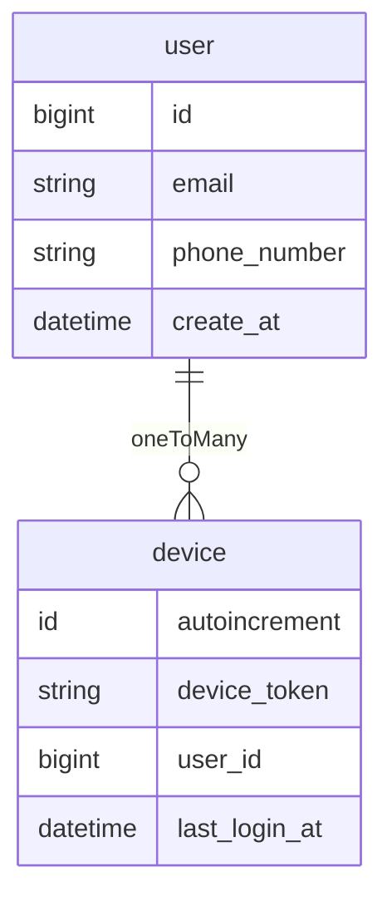
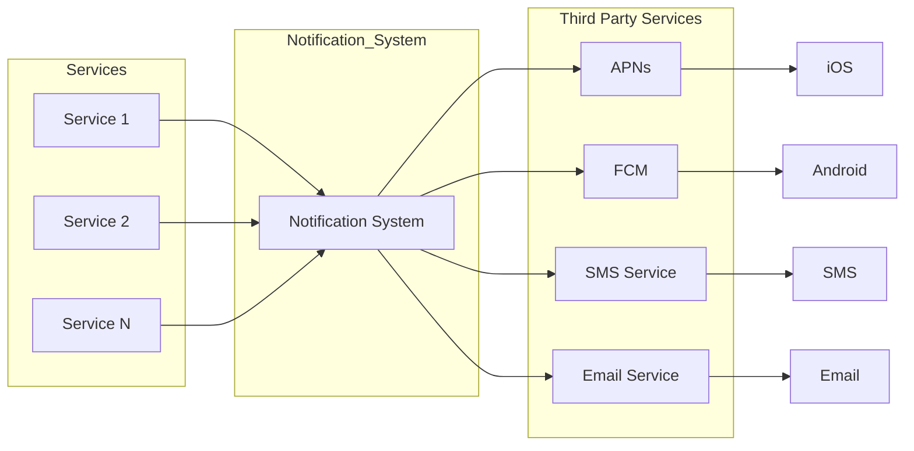
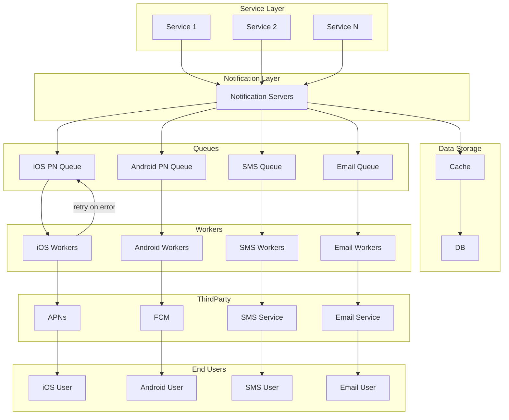

### Abstract
- 알림 시스템 하면 푸시알림을 대개 떠올리지만, 그렇지 않다
- 크게 다음과 같은 세 가지로 구분할 수 있다
	- 모바일 푸시 알림
	- SMS 메시지
	- 이메일
라고 한다
### Understand the problem and establish design scope
- 용진이형과 모의면접을 진행했을 때도 그랬지만, 대개 상황 자체가 모호하게 주어지는 경우가 많다
- 늘 그렇듯, 질문을 통해 구체화 해보자

- *어떤 알림을 지원해야 하는지?*
- *실시간을 지원해야하는지?*
	- *지연이 생긴다면 어느정도까지 허용하는지?*
- *지원해야하는 단말은 어느 종류인지?*
- *사용자가 받는 알림은 누가 만들 수 있는지?*
	- *사용자는 알림 설정을 각기 on/off 할 수 있는지?*
- *하루에 몇 건의 알림을 보낼 수 있어야 하는지?*

- 등의 질문을 통해 구체화할 수 있다

### Propose high-level design and get buy-in

다루는 내용은 아래와 같다
- 알림 유형별 지원 방안
- 연락처 정보 수집 절차
- 알림 전송 및 수신 절차

#####  푸시 알림
아래와 같은 규약을 통해
- 알림 제공자 -> APNS(애플) or FCM(안드로이드) -> device

- 알림 제공자(provider)
	- 알림 요청(notification request)을 만들어 푸시알림 서비스로 만드는 주체
	- 알림 요청을 만들려면 다음과 같은 데이터가 필요하다 
		- 단말 토큰(device token) : 알림 요청을 보내는 데 필요한 고유 식별자
		- 페이로드(payload) : 알림 요청을 담은 JSON dictionary
```json
{
	"aps" : {
		"alert" : {
			"title" : "Game Request",
			"body" : "Bob wants to play chess",
			"action-loc-key" : "PLAY"
		},
		"badge" : 5
	}
}
```
- APNS(apple push notification service) : 애플이 제공하는 원격 서비스. 푸시 알림을 ios 장치로 보내는 역할을 담당
- FCM(Firebase Cloud Messaging) : 구글이 지원 서비스
- device
##### SMS 메시지
SMS  메시지는 보통 제 3사업자의 서비스를 많이 이용한다. 상용 서비스라서 이용 요금을 내야한다
- 알림 제공자 -> SMS 서비스 -> SMS 수신 단말

##### 이메일
대부분의 회사는 고유 이메일 서버를 구축할 역량을 갖추고 있지만(모두는 아닐수도?), 그럼에도 많은 회사는 상용 이메일 서비스를 이용한다
- 알림 제공자 -> 이메일 서비스 -> 이메일 수신 단말


#### 연락처 정보 수신 절차
- 알림을 보내려면 *모바일 단말 토큰*, *전화번호*, *이메일 주소*등의 정보가 필요
- 앱을 처음 설치하거나, 처음 계정을 등록할 때 API 서버를 통해 해당 사용자의 정보를 수집하여 데이터베이스에 저장한다

- 연락처 정보를 저장할 때 테이블 구조는 아래와 같은 **1 : N 관계**로 한다
- 사용자가 여러 단말을 가질 수 있고, 알림은 모든 단말에 전송되어야 한다는 점을 고려한 설계



#### 설계 초안
- 1 부터 N 까지의 서비스
	- 서비스 각각은 microservice 일 수도 있고, cronjob일 수도 있고, 분산 시스템 컴포넌트일 수도 있다
	- e. g. ) 사용자에게 납기일을 알리고자 하는 과금 서비스(billing service), 배송 알림을 보내려는 쇼핑몰이 그 예
- 알림 시스템(notification system)
	- 알림 시스템은 **알림 전송/수신 처리의 핵심**
	- 여기서는 한 개의 서버만 사용하는 시스템이라고 가정할 것이다
	- 이 시스템은 서비스 1~N에 알림 전송을 위한 api를 제공해야 하고,
		  제 3자 서비스에 전달할 알림 payload를 만들어 낼 수 있어야 한다
  - 제 3자 서비스
	  - 이 서비스들은 사용자에게 알림을 실제로 전달하는 역할
	  - 제 3자 서비스와의 통합을 진행할 때 유의할 것은 확장성(extensibility)
		  - 쉽게 서비스를 통합하거나 기존 서비스를 제거할 수 있어야 함
	- 그리고 가끔씩 특정 국가에서는 사용 불가능한 경우도 있음(중국은 fcm 사용 불가 ㄷㄷ)
- ios, android, sms, email : 사용자는 자기 단말에서 알림을 수신



위 설계는 몇가지 문제가 있다
- SPOF : 알림 시스템이 하나밖에 없다는 것은, 그 서버에 장애가 생기면 전체 서비스의 장애로 이루어진다
- hard to scable : 하나의 서비스로 푸시 알림에 관련된 모든 것을 처리하므로, DB 혹은 cache 등 주요 컴포넌트의 규모를 개별적으로 늘릴 방법이 없다
- performance bottleneck : 알림을 처리하고 보내는 것은 자원을 많이 필요로 하는 작업일 수 있다
	- 예를 들어, HTML 페이지를 만들고 서드 파티 서비스의 응답을 기다리는 것은 시간이 많이 걸릴 수 있는 작업, 따라서 **모든 것을 한 서버로 처리하면 사용자 트래픽이 많이 몰리는 시간에는 시스템이 과부하 상태에 빠질 수 있다**

#### 개략적 설계안
문제점을 확인했으니, 다음과 같은 방향으로 개선해보려 한다
- DB와 cache를 알림 시스템의 주 서버에서 분리한다
- 알림 서버를 증설하고, 자동으로 scale out이 이루어질 수 있도록
- message queue 이용, 시스템 컴포넌트 사이의 강결합을 개선한다




- 알림 서버(notification server)는 다음 기능을 제공한다
	- 알림 전송 API : 스팸 방지를 위해 보통 사내 서비스 또는 인증된 클라이언트만 이용 가능
	- 알림 검증(validation) : 이메일 주소, 전화번호 등에 대한 기본적 검증을 수행
	- 데이터베이스 또는 캐시 질의 : 알림에 포함시킬 데이터를 가져오는 기능
	- 알림 전송 : 알림 데이터를 메시지 큐에 넣는다. 본 설계안의 경우 하나 이상의 메시지 큐를 이용하므로 알림을 병렬처리 가능
	- API Request Body 예제는 다음과 같다
```json
// RequestBody
{
  "to": [
    {
      "user_id": 123456
    }
  ],
  "from": {
    "email": "from_address@example.com"
  },
  "subject": "Hello, World!",
  "content": [
    {
      "type": "text/plain",
      "value": "Hello, World!"
    }
  ]
}
```
- 캐시(cache) : 사용자 정보, 단말 정보, 알림 템플릿(template) 등을 캐시한다
- DB : 사용자, 알림, 설정 등의 다양한 정보를 저장한다
- 메시지 큐(message queue) : 시스템 컴포넌트 간 의존성을 제거하기 위해 사용하며, 다량의 알림이 전송되어야 하는 경우를 대비한 버퍼 역할도 한다. 알림 서버별로 메시지 큐를 두어, 제 3자 서비스 중 하나에 장애가 발생해도 다른 종류의 알림은 정상 동작한다
- 작업 서버(workers) : message queue에서 사용할 알림을 꺼내 제3자 서비스로 전달하는 역할

### 알림 플로우
1. API 서버를 호출하여, 알림 서버로 보낸다
2. 알림 서버는 사용자 정보, 단말 토큰, 알림 설정 같은 메타 데이터를 캐시나 데이터베이스에서 가져온다
3. 알림 서버는 전송할 알림에 맞는 event 만들어서, 해당 이벤트를 위한 queue에 넣는다.
4. 작업 서버는 메시지 큐에서 알림 이벤트를 꺼낸다.
5. 작업 서버는 서드파티 서비스로 알림을 보낸다.
6. 제 3자 서비스는 사용자 단말로 알림을 전송한다.

생각보다 길어져서 다음 포스트에 이어서 작성할 예정